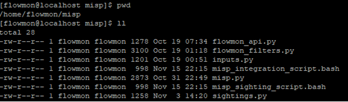

# Flowmon ADS to MISP integration

This document describes installing and configuring MISP integration capabilities into the Flowmon ADS module. For more information about the MISP platform, please visit the official website - <https://www.misp-project.org/>. This document is split into three parts:

1. Preparation of the script files
1. Sharing ADS events into the MISP platform
1. Adding MISP sightings to the MISP events

*Note: This script works for Flowmon ADS version 12 or newer. However, the MISP tags functionality is only available from the Flowmon ADS version 12.1, which is not released yet. In version 12.0, MISP events will be created without any flags.*
## Preparation of the script files
Before making any configuration changes in Flowmon UI, it is necessary to upload script files to the appropriate folder. This tutorial describes uploading the files using the SCP (SSH) protocol. If you don't have any software supporting this functionality, we suggest using WinSCP[^1] (Windows only) or FileZilla[^2] (multiplatform). The complete steps to upload script files are following:

1. Log in to your Flowmon appliance instance over SCP (SSH) protocol with username "flowmon".
1. Create a new (empty) directory with the name "misp" in folder "/home/flowmon".
1. Copy all script files to folder "/home/flowmon/misp".

The content of the folder "/home/flowmon/misp" should look as in the following picture #1.

Pic.1 – Flowmon console output for misp folder

## Sharing ADS events into the MISP platform
The main functionality of the provided script files is to allow Flowmon ADS appliances to export ADS events into the MISP platform. The following steps describe how to configure this functionality:

1. Create a new custom script in "Settings > System Settings > Custom scripts" by clicking on the button "+ New custom script".

Pic.2 – ADS configuration

1. In the new pop-up window, fill in the input name and select the file "misp\_integration\_script.bash" contained in the provided script files.
1. In the same window, it is necessary to specify a list of the script's parameters. For each parameter, click on the plus sign (Pic.3) in the parameters section and specify the name and the default value.

Pic.3 – New custom script dialog

1. Eight parameters need to be specified:
   1. misp\_server – Domain or IP address of the MISP server specified with the proper scheme (e.g., https://).
   1. misp\_api\_key – MISP API key for authentication. To get an API key, follow the instructions in the official documentation - <https://www.misp-project.org/openapi/>. Note: ensure the user has all the necessary permissions to create and publish events within the MISP platform.
   1. misp\_tag – Each MISP event created by this integration will contain this tag. If this tag doesn't exist on the server, it will be automatically created.
   1. misp\_ids – Each MISP event consists of several IoCs defined as MISP attributes. Each MISP attribute has one IDS flag to determine if an attribute can be automatically processed. By setting this value to 1, all attributes of a particular event would have an IDS flag set up to True. With the value 0, IDS flags would be set to False.
   1. misp\_distribution - This value controls who can see created MISP events. There are these possible values:
      1. 0 - Your organization only.
      1. 1 - This community only.
      1. 2 - Connected communities.
      1. 3 - All communities.
   1. flowmon\_filters – This attribute filters out IP addresses from events which should not be exported. By default, all private IPv4 and IPv6 addresses are excluded from events and there is no way how to export private addresses. However, with this attribute, it is possible to exclude additional addresses. The attribute can be an empty value, single value, or list of values (values separated by a comma). To find out more about the filters, please see the official Flowmon ADS documentation - <https://demo.flowmon.com/doc/adsplug/?file=59901302.html>.
   1. flowmon\_user – Username to the Flowmon appliance, where the integration script runs.
   1. flowmon\_pass – Password to the Flowmon appliance, where the integration script runs.

Pic.4 – Filled dialog with sample values

1. After saving the new custom script, the script needs to be activated. In the same section "Settings", go to "Processing > Custom scripts" and click on "+ New custom script action".

Pic.5 – Using custom script action in processing

1. In the new pop-up window, it is necessary to specify all the fields:
   1. Name – The name of the script action.
   1. Script – Select the script's name specified in step #2.
   1. Parameters – Either use default values specified in step #4 or edit as required.
   1. Perspective – Select the proper ADS perspective. For more information about the ADS perspectives, see the official documentation - <https://demo.flowmon.com/doc/adsplug/?file=47220847.html>. The purpose of the perspective is to select events that will trigger the script. So, these are events that will be converted into IoCs and published into MISP.
   1. Active – This field is used to enable or disable the script.
   1. Do not send empty records – This value is not relevant for this script. Keep default value.
   1. Minimal priority to be reported – Events from the specified perspective with lower priority will be ignored.
   1. Owner – Select who will be the owner of the script.

Pic.6 – Dialog for a custom script action

1. After saving the pop-up window, appropriate events start appearing in the MISP platform. To confirm whether the integration works, see if there are any new events in the MISP.
   
   
Pic.7 – MISP with Flowmon ADS events

## Adding MISP sightings to the MISP events
The second capability of the provided script files is MISP sightings. The MISP sightings work for MISP attributes downloaded from MISP to ADS using the blacklist's MISP type[^3] and used as actionable threat intelligence to detect events in Flowmon ADS. The following steps describe how to configure this functionality:

1. Create a new custom script in "Settings > System Settings > Custom scripts" by clicking on the button "+ New custom script".

Pic.8 - Adding custom script in System Settings

1. In the new pop-up window, fill in the input name and select the file "misp\_sighting\_script.bash" contained in the provided script files.
1. In the same window, it is necessary to specify a list of the script's parameters. For each parameter, click on the plus sign in the parameters section and specify the script's name and default value.

Pic.9 – New custom script dialog

1. Three parameters need to be specified:
   1. misp\_server – Domain or IP address of the MISP server specified with the proper scheme (e.g., https://).
   1. misp\_api\_key – MISP API key for authentication. To get an API key, follow the instructions in the official documentation - <https://www.misp-project.org/openapi/>.
   1. source – Each sighting has a string describing location or referencing the tool where the MISP attribute has been seen.

Pic.10 – Filled new custom scrip dialog

1. After saving the new custom script, the script needs to be activated. In the same section "Settings", go to "Processing > Custom scripts" and click on "+ New custom script action".

Pic.11 – Using custom script in processing

1. In the new pop-up window, it is necessary to specify all the fields:
   1. Name – The name of the script action.
   1. Script – Select the script's name specified in step #2.
   1. Parameters – Either use default values specified in step #4 or edit as required.
   1. Perspective – Select the proper ADS perspective. For more information about the ADS perspectives, see the official documentation - https://demo.flowmon.com/doc/adsplug/?file=47220847.html. The purpose of the perspective is to select events that will trigger the script.
   1. Active – This field is used to enable or disable the script.
   1. Do not send empty records – This value is not relevant for this script. Keep default value.
   1. Minimal priority to be reported – Events from the specified perspective with lower priority will be ignored.
   1. Owner – Select who will be the owner of the script.

Pic.12 – Filled dialog for a custom action

1. After saving the pop-up window, appropriate MISP attributes will start having sightings from Flowmon ADS. To confirm whether the integration works, see if there are any sightings in the MISP.

Pic.13 – MISP with sightings from ADS

[^1]: https://winscp.net
[^2]: https://filezilla-project.org
[^3]: https://demo.flowmon.com/doc/adsplug/?file=47220898.html